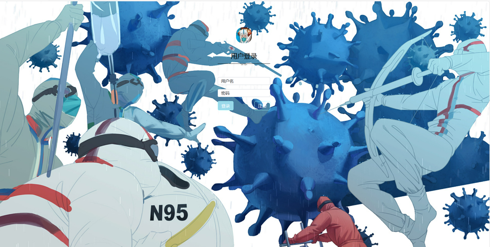
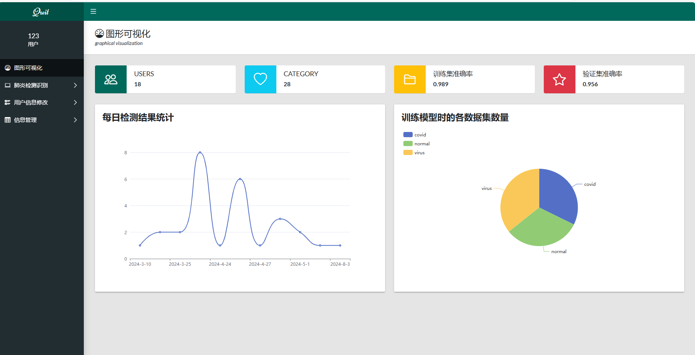
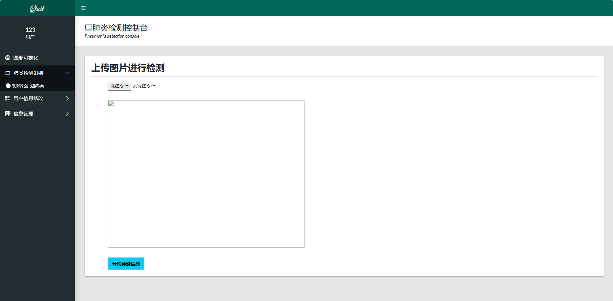
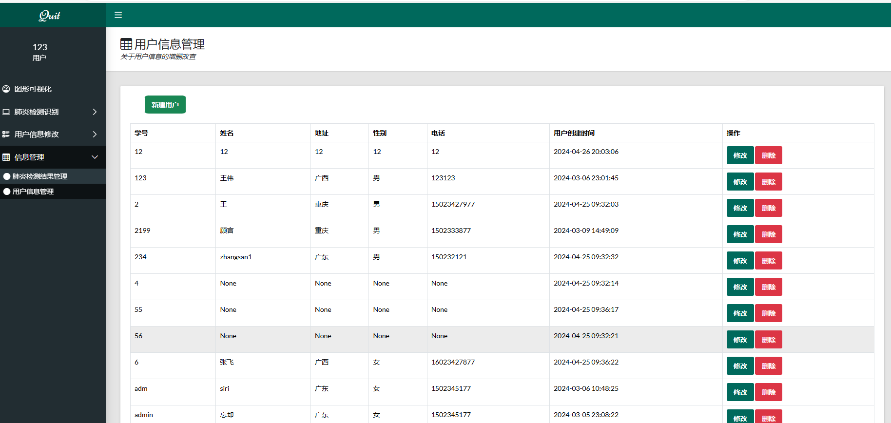

文件树: 
本项目主要是基于tensorflow构建的分类模型，运用flask框架进行web开发，运用bootstrap框架、开源项目X-admin进行前端开发，运用mysql数据库进行数据存储 
1)  app.py是整个系统的主入口 
2)  templates文件夹是HTML的页面 
     |-index.html 欢迎界面  
     |-dashboard.html 可视化大屏界面页面 
     |-add_user.html 添加用户页面 
     |-change_cate.html 修改识别分类页面 
     |-change_user.html 用户信息修改页面 
     |-table-basic.html 分类识别信息展示页面 
     |-bootstrap-components.html 分类识别页面 
     |- login.html 登录页面 
     |-res.html  注册页面 
     |-table-data-table.html  用户信息展示页面 
   
3)  static文件夹存放css和js，是页面的样式和效果的文件 
4) config文件夹下面：
     |-Config.py 配置数据库文件 
     |-data.sql 数据库连接界面 
5)  models文件夹：
     |- mobilenet_fv.h5 训练好的mobilenet模型参数 
     |- cnn_aoteman.h5 训练好的cnn模型参数 

部署步骤： 
* 0.安装所需的库 执行pip install -r requirement.txt 
* 1.执行config文件夹下面的data.sql文件,在这里cpu的tensorflow既可以进行系统的启动
* 2.启动app.py文件

## 界面展示
登录/注册界面

## 主界面

## 检测界面

## 用户信息展示

模型参数链接（百度网盘）：链接：https://pan.baidu.com/s/1TwvJxrGc8_p2oHCmXEr7ig?pwd=1234 
提取码：1234 
验证数据集链接（百度网盘）：链接：https://pan.baidu.com/s/1sH0s9lqvsmjK86PLFNP31A?pwd=1234 
提取码：1234

本项目开发基于X-admin，运用需遵守遵循Apache2开源协议发布
